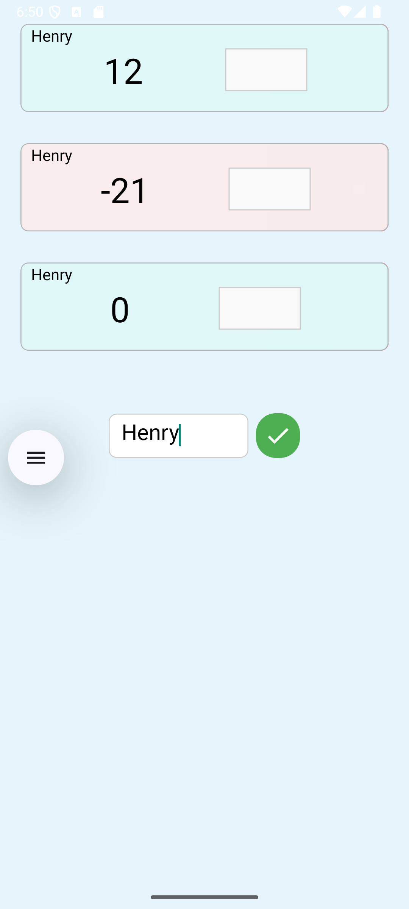
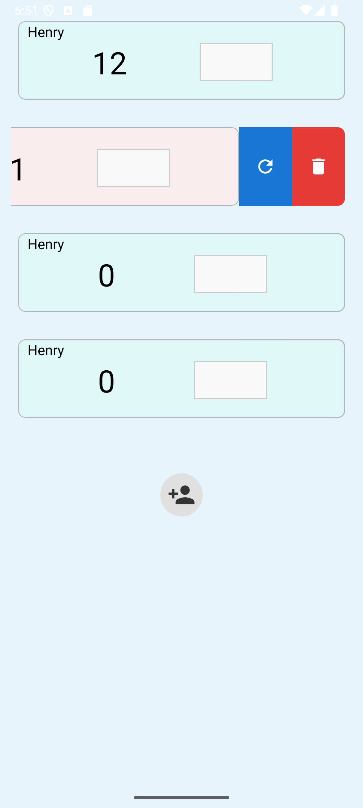

# Decription

A react-native application to keep track of scores during board games.

It ain't pretty but it's workin' !


<div style="display: flex; gap: 30px;">





</div>

<br/>
<br/>

# Running localy

## Step 1: Start Metro


```sh
npm start
```

## Step 2: Build and run your app


### Android

```sh
npm run android
```

### Troubleshooting

Some debug logs in terminal

```sh
npx react-native log-android
```

It's not working. Why ?

```sh
npm run react-native-doctor
```


# Installing on local device

```sh
npm run build-install
```
